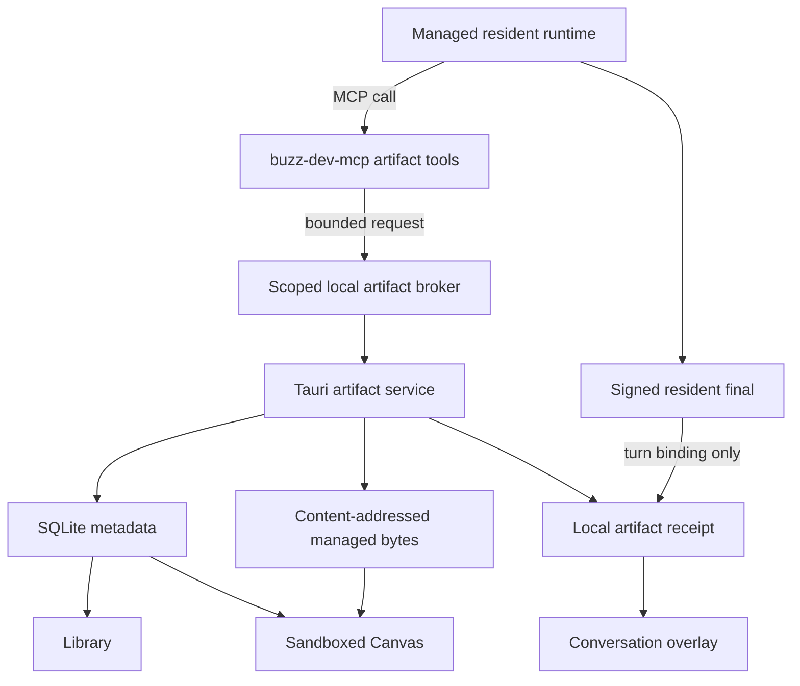

# System Contracts

These contracts are language-neutral. Implementations may adapt names to local
Rust and TypeScript conventions while preserving their semantics.

## Authority map



Conversation publication and artifact persistence are parallel outcomes of a
turn. Neither is a transaction prerequisite for the other.

## Domain records

```text
Artifact
  id: opaque stable ID
  owner_pubkey: identity scope
  installation_id: local installation scope
  title: user-visible title
  kind: image | markdown | text | code | svg | html | pdf | file
  media_type: sniffed authoritative MIME
  current_version: positive integer
  created_by_pubkey: resident or owner public identity
  conversation_id?: safe conversation ID
  project_id?: safe project ID
  source_turn_id?: opaque local turn ID
  source_message_id?: signed message event ID
  lifecycle_state: capturing | ready | preview_unavailable |
                   source_missing | deleted
  created_at, updated_at, deleted_at?

ArtifactVersion
  artifact_id
  version
  parent_version?: positive integer
  idempotency_key: request-bound unique key
  aggregate_hash: hash of canonical version manifest
  total_size_bytes
  entrypoint?: relative path
  source_turn_id?: opaque local turn ID
  source_message_id?: signed message event ID
  preview_state: pending | ready | unsupported | failed
  preview_error_code?: safe enum
  created_at

ArtifactFile
  artifact_id
  version
  relative_path: normalized slash-separated relative path
  blob_hash: sha256
  media_type: sniffed MIME
  size_bytes
  role: primary | supporting

ArtifactSourceBinding
  artifact_id
  owner_pubkey
  canonical_source_path: native-only absolute path
  source_identity: device-local file identity where available
  last_observed_hash
  state: available | moved | missing | denied
  checked_at

ArtifactReceipt
  id
  artifact_id
  version
  owner_pubkey
  resident_pubkey
  conversation_id
  turn_id
  message_id?
  state: provisional | linked | interrupted | orphaned
  created_at, linked_at?
```

Absolute paths are excluded from `Artifact`, `ArtifactVersion`, renderer DTOs,
observer payloads, diagnostics, and relay events.

## Storage layout

```text
{app_data}/artifacts/
  artifacts.sqlite3
  blobs/sha256/<first-two>/<full-hash>
  staging/<request-id>/
  quarantine/<request-id>/
```

- SQLite uses WAL and the same blocking-thread discipline as the existing
  desktop archive stores.
- Staging writes use restrictive permissions and are never previewed.
- Blob publication is temp-write, flush, atomic rename, then metadata commit.
- A committed metadata row never points at a missing blob.
- A crash before commit leaves only recoverable staging data.
- A crash after commit is safe because the immutable blob already exists.
- Garbage collection deletes only blobs unreferenced by all non-purged
  versions after the retention window.

## Broker request contracts

```text
ArtifactCreateRequestV1
  protocol
  request_id
  owner_pubkey
  resident_pubkey
  session_epoch
  conversation_id
  turn_id
  title
  kind
  source:
    InlineText { content_utf8, declared_media_type? }
    WorkspaceFile { relative_path, declared_media_type? }
  idempotency_key

ArtifactUpdateRequestV1
  same binding fields as create
  artifact_id
  expected_current_version
  optional new title
  source
  idempotency_key

ArtifactReadRequestV1
  same binding fields
  artifact_id
  version?
  response_mode: metadata | bounded_text

ArtifactListRequestV1
  same binding fields
  scope: current_conversation
  limit <= protocol maximum
```

The desktop independently validates every binding. Values supplied by the
model cannot widen conversation, resident, session, working-root, or owner
scope.

## Broker responses

```text
ArtifactWriteResultV1
  status: committed | duplicate | conflict | rejected | failed
  artifact_id?
  version?
  current_version?
  kind?
  title?
  safe_error_code?
  safe_message?

ArtifactReadResultV1
  status: ready | unavailable | denied | unsupported
  metadata
  bounded_content_utf8?
  truncated: boolean
```

Responses never contain absolute paths, broker tokens, signing material,
provider credentials, arbitrary SQL errors, or artifact bodies beyond the
bounded explicit read mode.

## Bounds

- Title: 1–160 Unicode scalar values after trim.
- Inline UTF-8 artifact: 5 MiB maximum.
- Workspace file snapshot: 100 MiB maximum.
- Text returned through `artifact_read`: 256 KiB maximum, with truncation flag.
- Initial artifact version: exactly one file.
- Relative path: 1,024 UTF-8 bytes maximum after normalization.
- List results: 100 maximum.
- Broker frame: 6 MiB maximum so a maximal inline artifact plus envelope fits.
- Image preview: reject decode above 100 megapixels even when bytes are small.

Bounds live in one shared protocol module and have positive/negative vectors.

## Idempotency and concurrency

- Create idempotency key binds owner, resident, session epoch, conversation,
  turn, request ID, kind, and source hash.
- Update also binds artifact ID and expected current version.
- Replaying an accepted key returns the original receipt.
- Reusing a key with different bytes is rejected.
- Two updates with the same expected version allow at most one append.
- Conflict returns the current version and performs no write.
- Revert is an update whose source is a prior immutable version.

## Renderer-facing Tauri API

```text
list_artifacts(filter, cursor, limit) -> metadata page
get_artifact(id) -> metadata without source path
list_artifact_versions(id) -> version metadata
read_artifact_preview(id, version) -> bounded typed preview payload
import_artifact_from_picker(options) -> receipt
rename_artifact(id, title) -> metadata
pin_artifact(id, pinned) -> metadata
revert_artifact(id, version, expected_current_version) -> receipt
soft_delete_artifact(id) -> tombstone
restore_artifact(id) -> metadata
export_artifact(id, version) -> native save result
reveal_artifact_source(id) -> native action result
```

`reveal_artifact_source` performs the action natively. It does not return the
path to ordinary renderer code.

## Local event contracts

```text
artifact-capture-started
artifact-version-committed
artifact-receipt-linked
artifact-preview-state-changed
artifact-source-state-changed
artifact-deleted
```

Events contain safe IDs and state only. UI always re-reads authoritative data
from the Tauri API; events are invalidation signals, not a second store.

## Conversation binding

1. Artifact commit creates a provisional receipt bound to the managed turn.
2. The final-publication path reports the accepted signed message ID to the
   artifact service through a narrow local method.
3. The service transitions matching receipts from `provisional` to `linked`.
4. Timeline projection queries receipts by owner + conversation + message/turn.
5. If the turn ends without a final, the artifact remains in Library with an
   `interrupted` or `orphaned` receipt; bytes are never discarded implicitly.

No artifact tag is added to the Nostr message in static V1.

## Preview payloads

```text
TextPreview { utf8, truncated, language? }
BinaryPreview { bytes, media_type, filename }
HtmlPreview { utf8, injected_csp_version }
UnsupportedPreview { media_type, filename, size_bytes, reason }
```

Preview bytes are supplied only on explicit selection. Library metadata queries
never load them.
