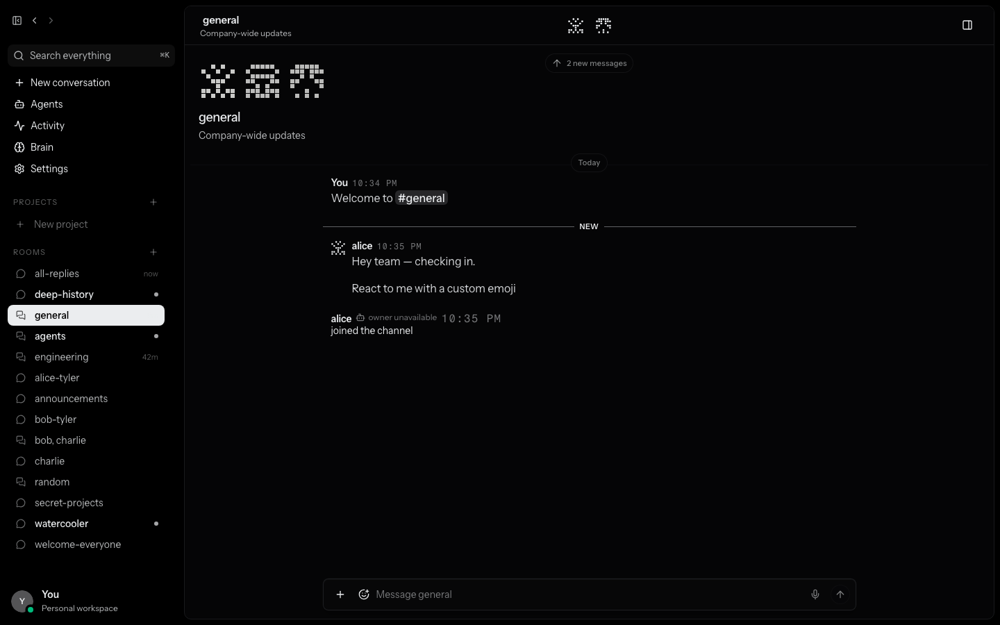

# Conversation + Communication Integration Receipt

## Verdict

**INTEGRATED — SOURCE CHECKPOINT VERIFIED; NATIVE SIGNING BLOCKED**

The approved conversation-design and communication-parity histories merge cleanly and the combined behavioral, authority, frontend, and isolated-browser checks below pass. File-size thresholds are review signals under the current repository policy and do not mechanically block this checkpoint.

No installed application was rebuilt or replaced. Native promotion remains blocked until a valid Developer ID Application identity for the authorized team is available in the login keychain.

## Checkpoint

- Integration branch: `codex/conversation-communication-integration`
- Verified product checkpoint: `80510dbe026039ea923bab81cde9cc65e049af4e`
- Merge commit: `e4b6a1c4aaa285ac77b63147a33457171875d7c3`
- Design parent: `0bfbd7a7eec70d55c16253314f810c49eee9d9d3`
- Communication parent: `b49ee31057897ad8aa4388098bd7a4e75f8a9623`
- Shared base: `81762ad144368bd1b5f5e7f144fdd19a57466676`
- Merge method: two-parent `--no-ff` merge; neither source history was rewritten or cherry-picked.

The verified product checkpoint adds three bounded integration-hardening commits after the merge and advisory file-size policy:

- `1f0dc5e` reduces the guarded membership insert outcome's stack size without changing behavior.
- `d16b53f` applies repository Rust formatting to the integrated communication authority files.
- `80510db` resolves strict Tauri lint findings without changing runtime behavior.

## Registry reconciliation

Verified in the merged source:

- `crates/luca-protocol/src/lib.rs` retains `MANAGED_DISPATCH_RECEIPT_TAG`, declares `communications`, and exports its public protocol surface.
- `desktop/src-tauri/src/luca/mod.rs` retains `managed_message_event` and declares all six communication authority modules:
  - `communication_action_backend`
  - `communication_action_outbox`
  - `communication_action_publisher`
  - `communication_bridge`
  - `communication_event_vault`
  - `communication_turn_registry`

No conversation renderer, composer, activity-shelf, streaming-geometry, identity-mark, Graphite, or shell-style conflict required a visual resolution. The design parent remains authoritative for those paths.

## Focused command evidence

All commands ran from the isolated integration worktree.

### Communication and authority

- `cargo test -p luca-protocol` — PASS, including communications and existing Brain/continuity/handoff vectors.
- `cargo test -p buzz-acp communications --lib` — PASS, 9 tests.
- `cargo test -p buzz-dev-mcp luca_communications --lib` — PASS, 9 tests.
- `cargo test -p buzz-relay expected_membership --lib` — PASS, 2 tests.
- Tauri `communication_action` filter — PASS.
- Tauri `communication_event_vault` filter — PASS, 7 tests.
- Tauri `communication_bridge` filter — PASS, 8 tests.
- Tauri `managed_agents::runtime::tests` filter — PASS, 42 tests.
- Tauri `luca_inbox` filter — PASS, 13 tests.

### Frontend and conversation

- Desktop unit suite — PASS, 3,562 tests across 43 suites.
- Desktop typecheck — PASS.
- Production frontend build — PASS; only the repository's existing chunk-size/dynamic-import warnings were emitted.
- E2E frontend build — PASS.
- Conversation reliability, stream geometry, activity shelf, Graphite — PASS, 13/13.
- Native Inbox bridge and project/room navigation — PASS, 6/6 before the legacy mention suite continued.
- The current mention-selector/activity-shelf regression case — PASS.
- Isolated combined visual/console check — PASS, 1/1 with no console errors or page errors.
- `git diff --check` — PASS.

The broad legacy `mentions.spec.ts` still contains two assertions for deliberately removed surfaces: the old `Fizz` identity and the old `message-thread-panel` drawer. Those assertions were not rewritten during this integration because the approved Luca design replaces Fizz and uses the focused thread surface. Current directed-reply/thread behavior is covered by the green conversation-reliability matrix.

## File-size review warnings

The shared checker reports these files for human architecture/cohesion review while exiting successfully:

- `src-tauri/src/commands/luca_inbox.rs`: 1,028 lines, limit 1,000.
- `src-tauri/src/commands/messages.rs`: 1,119 lines, retained ratchet 1,110.
- `src-tauri/src/luca/communication_action_outbox.rs`: 1,211 lines, limit 1,000.
- `src-tauri/src/luca/communication_action_publisher.rs`: 1,753 lines, limit 1,000.
- `src-tauri/src/luca/communication_bridge.rs`: 1,640 lines, limit 1,000.
- `src-tauri/src/luca/managed_dispatch_store.rs`: 2,783 lines, retained ratchet 2,538.
- `src-tauri/src/managed_agents/runtime.rs`: 2,733 lines, retained ratchet 2,620.

These warnings are inherited from the communication source checkpoint, not a textual merge conflict. They do not justify cosmetic splitting. A future architecture/security review may still recommend substantive extraction based on cohesion, complexity, or authority boundaries.

The shared checker policy was verified with focused tests proving that threshold violations warn and return success while malformed checker configuration still rejects normally. Desktop, web, and mobile all use this shared behavior.

Focused policy verification:

- `node --test scripts/check-file-sizes-core.test.mjs` — PASS, 2/2.
- `node desktop/scripts/check-file-sizes.mjs` — PASS with the seven warnings above.
- `node web/scripts/check-file-sizes.mjs` — PASS.
- `node mobile/scripts/check-file-sizes.mjs` — PASS.
- Full desktop `pnpm check` — PASS, including file-size warnings, pixel-text, public-key, and 58-capability communication-ledger checks; seven pre-existing onboarding CSS warnings remain non-failing.
- Full repository `just ci` — PASS at verified product checkpoint `80510db`, including workspace formatting, strict Clippy, workspace tests, desktop checks/build/tests, Tauri checks/tests, web build, and mobile tests.

## Native promotion preflight

- The branch-specific installed app remains at version `0.4.22` with the intended bundle identifier and keyring scope.
- The running relay on port `3030` remains healthy and untouched.
- The current installed executable hash is `b600edb76f22158a9420a216327705723a520131219f60300b95c5cd6ce59852`; it remains the rollback reference for this promotion attempt.
- Read-only verification found zero valid code-signing identities in the login keychain.
- The existing installed bundle does not pass strict deep code-signing verification (`CSSMERR_TP_NOT_TRUSTED`). This is historical installed-bundle state, not a result of the combined source checkpoint.
- No unsigned or ad-hoc candidate was built, launched, or installed. Promotion must resume only after the valid Developer ID Application identity is restored, then perform an exact branch-specific build, entitlement check, strict signature verification, rollback capture, atomic replacement, and installed acceptance.

## Browser evidence

The isolated mock build shows the approved conversation shell, centered resident presence, open timeline, stable composer/activity reservation, project/room rail, and Graphite-compatible tonal treatment without a console error. It does not claim installed-native acceptance.

## Deferred operations

This checkpoint does **not** claim or perform:

- installed app rebuild or replacement;
- native runtime provisioning;
- native configuration, credential, memory, workspace, model, session, or schedule writes;
- arbitrary filesystem escalation;
- Brain picker or Project Sources/Details repair;
- unified project/context redesign;
- push, pull request, or branch fast-forward.
