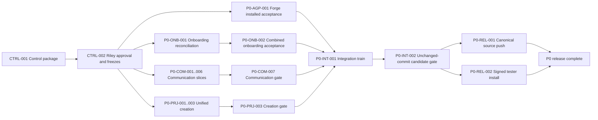

# Luca program graph

`PROGRAM_GRAPH.yaml` is the machine authority. This file is the human reading
of the same execution model.

## Critical path

The longest merge-risk path runs through onboarding because it carries eight
unmerged commits and overlaps 88 files with the newer shell. Communication
activation is the highest authority risk. Unified creation is the highest
cross-domain risk because projects must not imply grants. Forge is
acceptance-first and joins the path only if native proof reveals a repair.

## Locked prerequisites

| ID | Capability | Delivery state | Rule |
|---|---|---|---|
| BASE-001 | Stable identity, native runtimes, direct/group conversation, cancellation, permission | `verified_in_installed_application` | Preserve; reopen only on concrete regression |
| BASE-002 | Continuity/Notebook/Brain/Settings/project navigation | `verified_in_installed_application` | Conversation remains independent; grants remain explicit |
| CTRL-001 | Program-control package | `source_tested` on exact pre-promotion commit `63900cd2cb48299e24e73b0736c3faf95d8b6337` | Documentation only |
| CTRL-002 | Riley approval and shared-interface ratification | `source_tested`; PC-G0 approved with corrections applied | Team setup authorized; product writes remain gated |

## P0 task index

| ID | Owner | Objective | Input truth | Depends on | Wave |
|---|---|---|---|---|---|
| P0-ONB-001 | Experience | Reconcile production onboarding onto the audited base | Eight source-tested commits are unmerged | CTRL-002 | 1 |
| P0-ONB-002 | Experience | Prove clean and returning profiles at desktop/mobile widths | No combined installed proof | P0-ONB-001 | 2 |
| P0-COM-001 | Communications | Managed reactions, author edit, exact approved delete | Planned | CTRL-002 | 1 |
| P0-COM-002 | Communications | A2A DM/private-room creation, invitations, membership sagas | Planned | CTRL-002 | 1 |
| P0-COM-003 | Communications | Opaque artifact-handle attachment publication | Planned | CTRL-002 | 1 |
| P0-COM-004 | Communications | Bounded delivery/activation with loop, retry, offline, cancellation truth | Planned | P0-COM-002 | 1–2 |
| P0-COM-005 | Communications | Resident Inbox plus complete owner Inbox state/deep links | Owner subset integrated | CTRL-002 | 1–2 |
| P0-COM-006 | Communications | Receipt-backed Activity projection for communication work | Partial UI activity exists | P0-COM-001..005 | 2 |
| P0-COM-007 | Communications | Close browser/native/restart/security/runtime acceptance | Not started | P0-COM-001..006 | 2 |
| P0-PRJ-001 | Projects | Unified project, source, room, resident creation | Basic creation integrated | CTRL-002 | 1–2 |
| P0-PRJ-002 | Projects | Repair Add Folder and Project Sources/Details | Partial | CTRL-002 | 1 |
| P0-PRJ-003 | Projects | Prove create/reopen/edit/recover with separate grants | Not started | P0-PRJ-001, P0-PRJ-002 | 2 |
| P0-AGP-001 | Agent Platform | Close disposable signed Hermes/OpenClaw Forge matrix | Source-tested | CTRL-002 | 1 |
| P0-INT-001 | Program | Assemble exact accepted commits on the integration train | Planned | All P0 team gates | 3 |
| P0-INT-002 | Program | Run unchanged-commit release, security, QA, and installed gate | Planned | P0-INT-001 | 4 |
| P0-REL-001 | Program | Promote and push one canonical source branch | Local/fragmented | P0-INT-002 | 5 |
| P0-REL-002 | Program | Build, sign, install, hash, and identify one tester app | Branch-specific app exists | P0-INT-002 | 5 |

## P1 task index

| ID | Owner | Objective | Activation dependency |
|---|---|---|---|
| P1-AGP-001 | Agent Platform | Freeze and build Skills Library discovery, lifecycle, compatibility, and grants | P0 release |
| P1-AGP-002 | Agent Platform | Complete effortless natural-language resident creation over shared owner review | P0 Forge installed acceptance |
| P1-CCS-001 | Clients | Freeze native SwiftUI companion architecture around existing pairing | P0 candidate interfaces |
| P1-CCS-002 | Clients | Build rooms/DM/history/send/reconnect/approvals/attachments/push MVP | P1-CCS-001 |
| P1-CCS-003 | Clients | Real-iPhone and TestFlight acceptance | P1-CCS-002 |
| P1-PBC-001 | Projects | Finish Brain picker/detail/grant/indexing/recovery usability | P0-PRJ-003 |
| P1-PBC-002 | Projects | Add exact resident-requested folder/repository access with owner review | P1-PBC-001 |
| P1-INT-001 | Program | Migration, offline, accessibility, packaging, updater, backup/restore hardening | P0 release |

## P2 task index

| ID | Owner | Objective | Activation dependency |
|---|---|---|---|
| P2-PBC-001 | Projects | Explicit same-resident Reflection V1.3 | P0 release and new frozen contract |
| P2-PBC-002 | Projects | Obsidian read/search/watch/grants, then approved write/undo | Connector substrate freeze |
| P2-CCS-001 | Clients | Reconcile and commit the Artifact/Canvas packet | P0 release |
| P2-CCS-002 | Clients | Owner static artifact library/canvas with immutable versions | P2-CCS-001 |
| P2-CCS-003 | Clients | Scoped resident artifact create/update/read/list | P2-CCS-002 |
| P2-PBC-003 | Projects | Expanded Unified Brain discovery, staged import, archive, provenance | P1-PBC-001 |
| P2-PBC-004 | Projects | Gmail/Google read/search | Connector substrate freeze |
| P2-PBC-005 | Projects | Drafts, then exact-approved external actions | P2-PBC-004 |

## P3 and deferred task index

| ID | Owner | Objective | Status | Required precursor |
|---|---|---|---|---|
| P3-PBC-001 | Projects | Database adapters and broad connector platform | Deferred | Connector authorization/provenance/egress contract |
| P3-PBC-002 | Projects | Local embeddings, associative expansion, revision-bound code graph | Deferred | Unified Brain acceptance and measured retrieval need |
| P3-PBC-003 | Projects | Scheduled reflection, quiet hours, proactive outreach, richer inner life | Deferred | Reflection V1.3, budgets, Inbox/Activity, owner controls |
| P3-AGP-001 | Agent Platform | One stable resident with bounded internal multi-model delegation | Spec only | Runtime budgets, attribution, cancellation, recovery |
| P3-AGP-002 | Agent Platform | Optional conductor as ordinary project role | Spec only | Roles, grants, budgets, communication, activation, Inbox, Activity, audit |
| P3-COM-001 | Communications | True NIP-17/group E2EE | Deferred | Separate privacy and migration milestone |
| P3-CCS-001 | Clients | Multimedia Notebook, live artifact apps, voice, creative surfaces | Deferred | Static artifacts and explicit process/network authority |
| P3-CCS-002 | Clients | Shared/multi-user administration and concurrent device authority | Deferred | Roles, device administration, conflict/write-authority model |
| P3-CCS-003 | Clients | iMessage gateway | Deferred/closed | Explicit Riley reopen plus platform/legal reliability review |

## Interface and conflict analysis

- Onboarding, projects, communications, and Forge all touch the app shell or
  resident selection. `IF-01` through `IF-04` freeze those seams before writes.
- Communication delivery, Activity, and Inbox share event identity and receipt
  semantics. They must share `IF-05`; UI projection cannot invent success.
- Projects, Brain, and connectors share authorization but not membership.
  `IF-06` forbids inferred grants.
- Agent Platform and Communications share runtime turn/cancellation boundaries.
  `IF-07` forbids descendants from acquiring signing or durable authority.
- Mobile and artifacts consume desktop contracts only after P0; they do not
  reshape P0 registries in parallel.
- Lockfiles, migrations, event-kind registries, app registration, global state,
  and release metadata are Program-owned hotspots.

## Coverage rule

Every incomplete, partial, unmerged, specified, not-started, or deferred row in
the program-status package maps to at least one graph node. Verified
foundations map to BASE-001 or BASE-002 so later teams know which behavior must
not regress. Explicitly closed Buzz surfaces remain outside the graph unless
Riley reopens them. The optional conductor is the one deliberate
reclassification made by this control package.
