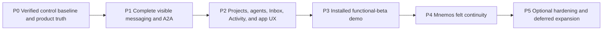

# Luca P0–P5 program graph

The machine-readable authority is `PROGRAM_GRAPH.yaml`. This view summarizes
its milestone order, counts, and activation gates.

## Control sequence

| Task | Meaning | Current state |
|---|---|---|
| BASE-001 | Audited integrated product checkpoint | `verified_in_installed_application` |
| BASE-002 | Preserved onboarding/adjacent source inventory | `source_tested` |
| CTRL-001 | Historical first control package | `source_tested` on its recorded exact commit |
| CTRL-002 | Historical bounded approval/corrections | `implemented_in_source`; the later promotion commit did not complete final validation |
| CTRL-003 | This revised P0–P5 control package | `source_tested` on exact pre-promotion commit `b63d7ca8f41f9c46e71c07dae364ab0aa4f70e8b` |
| CTRL-004 | Riley approval of the revised graph | `source_tested` on exact approval receipt `7cc3bc54278eba8300b7c02bd94bd07a4b39e2f3`; five-team activation authorized |

## Task-count comparison

| Graph | Total | Distribution | Explanation |
|---|---:|---:|---|
| Previous control graph | 46 | 2 base, 2 control, 17 P0, 8 P1, 8 P2, 9 P3 | Security-heavy communication and release work mixed visible product closure with generalized hardening |
| Revised graph | 69 | 8 P0, 12 P1, 18 P2, 7 P3, 9 P4, 15 P5 | Visible behaviors are split into independently acceptable tasks; Mnemos is explicit P4; hardening and deferred expansions are isolated in P5 |

No approved visible behavior was removed. The increase is intentional: existing
capabilities, presentation reconnection, thin managed adapters, installed
acceptance, and future hardening now have separate status and ownership.

## Milestone summary

| Milestone | Tasks | Exit condition |
|---|---:|---|
| P0 | 8 | Product-truth/reuse classification validated on an exact commit and CTRL-004 approved by Riley |
| P1 | 12 | Full visible local messaging/A2A passes browser, native, restart, and exact-publication acceptance |
| P2 | 18 | Onboarding, native agents, projects, core surfaces, Inbox/Activity, and failure UX work together |
| P3 | 7 | One unchanged source SHA is built, installed, demoed, documented, and promoted to the beta branch only after approval |
| P4 | 9 | Native-runtime-authored continuity and identity are provenance-correct, revisable, private, and fail-soft |
| P5 | 15 | Only explicitly activated hardening or deferred expansion work proceeds |

## Complete task index

### P0 task index

| ID | Owner | Category | Task |
|---|---|---|---|
| BASE-001 | Program Integration & Release | existing architectural constraint | Preserve audited installed product foundation |
| BASE-002 | Program Integration & Release | existing architectural constraint | Preserve source coordinates and unmerged experience inventory |
| CTRL-001 | Program Integration & Release | existing architectural constraint | Historical program-control package |
| CTRL-002 | Program Integration & Release | existing architectural constraint | Historical bounded approval and correction record |
| CTRL-003 | Program Integration & Release | product requirement | Revise control package to functional-product-first P0-P5 graph |
| TRUTH-001 | Program Integration & Release | product requirement | Reconcile functional hidden reusable adapter and missing capability truth |
| REUSE-001 | Program Integration & Release | existing architectural constraint | Classify communication commits and existing Buzz reuse before new architecture |
| CTRL-004 | Program Integration & Release | product requirement | Riley approves revised graph ownership and activation order |

### P1 task index

| ID | Owner | Category | Task |
|---|---|---|---|
| COM-101 | Communications & Collaboration | product requirement | Preserve direct owner-to-resident DM and group messaging with verbatim resident output |
| COM-102 | Communications & Collaboration | product requirement | Connect managed residents to existing DM room creation and membership operations |
| COM-103 | Communications & Collaboration | product requirement | Connect replies mentions invitations and explicit visible A2A activation |
| COM-104 | Communications & Collaboration | product requirement | Connect managed reactions and author edits through existing event builders |
| COM-105 | Communications & Collaboration | recommended safety measure | Add narrow confirmation for deletion external recipients authority changes broadcasts and material effects |
| COM-106 | Communications & Collaboration | product requirement | Connect managed attachment publication to the existing media pipeline |
| COM-107 | Communications & Collaboration | existing architectural constraint | Preserve signed events relay rooms membership DMs groups and host publication as the conversation plane |
| COM-108 | Communications & Collaboration | product requirement | Preserve and present search unread read and canonical deep links |
| COM-109 | Communications & Collaboration | product requirement | Restore a useful owner Inbox from existing events and projections |
| COM-110 | Communications & Collaboration | product requirement | Restore useful Activity from existing events and runtime publication |
| COM-111 | Communications & Collaboration | existing architectural constraint | Keep Direct mode default with no routine local communication approvals |
| COM-112 | Communications & Collaboration | recommended safety measure | Prove cancellation restart duplicate suppression and exactly-once final publication |

### P2 task index

| ID | Owner | Category | Task |
|---|---|---|---|
| ONB-201 | Experience & Onboarding | product requirement | Reconcile complete clean-profile onboarding onto the current shell |
| ONB-202 | Experience & Onboarding | product requirement | Preserve returning-profile bypass recovery and readiness truth |
| ONB-203 | Experience & Onboarding | product requirement | Verify onboarding keyboard screen-reader reduced-motion and compact-width behavior |
| AGT-201 | Agent Platform | product requirement | Present native Hermes and OpenClaw discovery import and readiness coherently |
| AGT-202 | Agent Platform | product requirement | Complete in-app manual and conversational resident creation |
| AGT-203 | Agent Platform | product requirement | Complete resident configuration start stop restart and relaunch controls |
| AGT-204 | Agent Platform | product requirement | Make Agent Library Settings runtime health and MCP grants one coherent system |
| AGT-205 | Agent Platform | existing architectural constraint | Preserve stable identity, host signing, credential isolation, read-only discovery, runtime-owned configuration writes, and unrelated native-state immutability |
| PRJ-201 | Projects, Brain & Connections | product requirement | Complete unified project creation with optional first room residents and sources |
| PRJ-202 | Projects, Brain & Connections | product requirement | Complete repository folder source and Brain Setup entry points |
| PRJ-203 | Projects, Brain & Connections | product requirement | Complete project details edit reopen recovery and empty states |
| PRJ-204 | Projects, Brain & Connections | existing architectural constraint | Preserve project-room-resident-source organization without implicit authority |
| PRJ-205 | Projects, Brain & Connections | product requirement | Complete project-room navigation including loose rooms and DMs |
| UX-201 | Experience & Onboarding | product requirement | Preserve the blackout shell timeline composer and complete messaging controls |
| UX-202 | Experience & Onboarding | product requirement | Present Agent Library Settings Brain Setup Notebook Inbox and Activity as one product |
| UX-203 | Experience & Onboarding | product requirement | Make cancellation restart duplicates offline and unavailable runtimes understandable |
| UX-204 | Experience & Onboarding | product requirement | Verify desktop-to-compact responsive accessibility and visual polish |
| UX-205 | Clients & Creative Surfaces | existing architectural constraint | Preserve desktop mobile-pairing foundations as Mac-hosted resident access |

### P3 task index

| ID | Owner | Category | Task |
|---|---|---|---|
| INT-301 | Program Integration & Release | product requirement | Create and assemble the functional-beta integration train after P1 and P2 gates |
| INT-302 | Program Integration & Release | recommended safety measure | Run combined clean returning restart offline and regression gates on one SHA |
| DEMO-301 | Program Integration & Release | product requirement | Build sign install and launch the unchanged macOS candidate |
| DEMO-302 | Program Integration & Release | product requirement | Run the real Hermes OpenClaw messaging project and recovery demo |
| DEMO-303 | Program Integration & Release | recommended safety measure | Publish truthful preview privacy and data-sensitivity language |
| REL-301 | Program Integration & Release | product requirement | Promote the accepted candidate to luca v1-beta without source drift |
| REL-302 | Program Integration & Release | product requirement | Update handoff status release coordinates and reproducibility evidence |

### P4 task index

| ID | Owner | Category | Task |
|---|---|---|---|
| MNEM-401 | Agent Platform | product requirement | Load native identity documents through the exact bound resident runtime |
| MNEM-402 | Projects, Brain & Connections | product requirement | Generate resident-authored handoffs verbatim with attribution |
| MNEM-403 | Projects, Brain & Connections | product requirement | Consolidate notes notebooks journals and identity-aware retrieval |
| MNEM-404 | Projects, Brain & Connections | product requirement | Add explicit same-resident reflection and bounded proposals |
| MNEM-405 | Projects, Brain & Connections | product requirement | Add hypomnema and associative recall as supplemental context |
| MNEM-406 | Projects, Brain & Connections | existing architectural constraint | Preserve provenance revisions corrections pins archive and forget |
| MNEM-407 | Agent Platform | existing architectural constraint | Keep native identity authoritative and retrieved memory supplemental |
| MNEM-408 | Communications & Collaboration | recommended safety measure | Guarantee continuity failure never blocks conversation or substitutes another author |
| MNEM-409 | Clients & Creative Surfaces | product requirement | Add richer inner-life and creative Notebook surfaces without false autonomy claims |

### P5 task index

| ID | Owner | Category | Task |
|---|---|---|---|
| SEC-501 | Communications & Collaboration | optional hardening | Add Guarded and Restricted modes if user research justifies them |
| SEC-502 | Communications & Collaboration | optional hardening | Generalize exact-turn leases beyond current functional operations |
| SEC-503 | Communications & Collaboration | optional hardening | Generalize action outboxes approval bindings and receipt Activity |
| SEC-504 | Communications & Collaboration | optional hardening | Add advanced causal graphs and unrestricted auto-reply controls |
| SEC-505 | Communications & Collaboration | optional hardening | Evaluate NIP-17 or equivalent end-to-end encrypted delivery |
| SEC-506 | Agent Platform | optional hardening | Add production key rotation recovery and multi-device writer transfer |
| SEC-507 | Program Integration & Release | optional hardening | Complete hostile multi-tenant adversarial and abuse hardening |
| EXT-501 | Clients & Creative Surfaces | deferred enhancement | Build the full native mobile companion on Mac-hosted residents |
| EXT-502 | Clients & Creative Surfaces | deferred enhancement | Build Artifact Library and static Canvas |
| EXT-503 | Agent Platform | deferred enhancement | Build Skills Library discovery grants and lifecycle |
| EXT-504 | Projects, Brain & Connections | deferred enhancement | Expand Unified Brain discovery import formats archives and migration |
| EXT-505 | Projects, Brain & Connections | deferred enhancement | Add Obsidian and Google connectors through staged read-first contracts |
| EXT-506 | Agent Platform | deferred enhancement | Add one stable resident identity with bounded internal multi-model delegation |
| EXT-507 | Agent Platform | deferred enhancement | Evaluate an optional ordinary project conductor role with no hidden authority |
| EXT-508 | Clients & Creative Surfaces | deferred enhancement | Evaluate multi-user voice live artifacts database adapters and remote sync separately |

## Activation rules

- P1 cannot start until CTRL-004.
- P2 implementation may overlap P1 only for disjoint owned files after CTRL-004;
  P2 integration waits for P1's frozen communication acceptance commit.
- P3 starts only after P1 and P2 are source-tested.
- P4 starts after the functional-beta demo is verified, except read-only
  archaeology and contract preparation.
- P5 requires separate Riley activation per task; no P5 task is on the beta
  critical path.

The five proposed teams and their coordinates are listed in `WAVE_PLAN.md`.
They are intentionally inactive.
