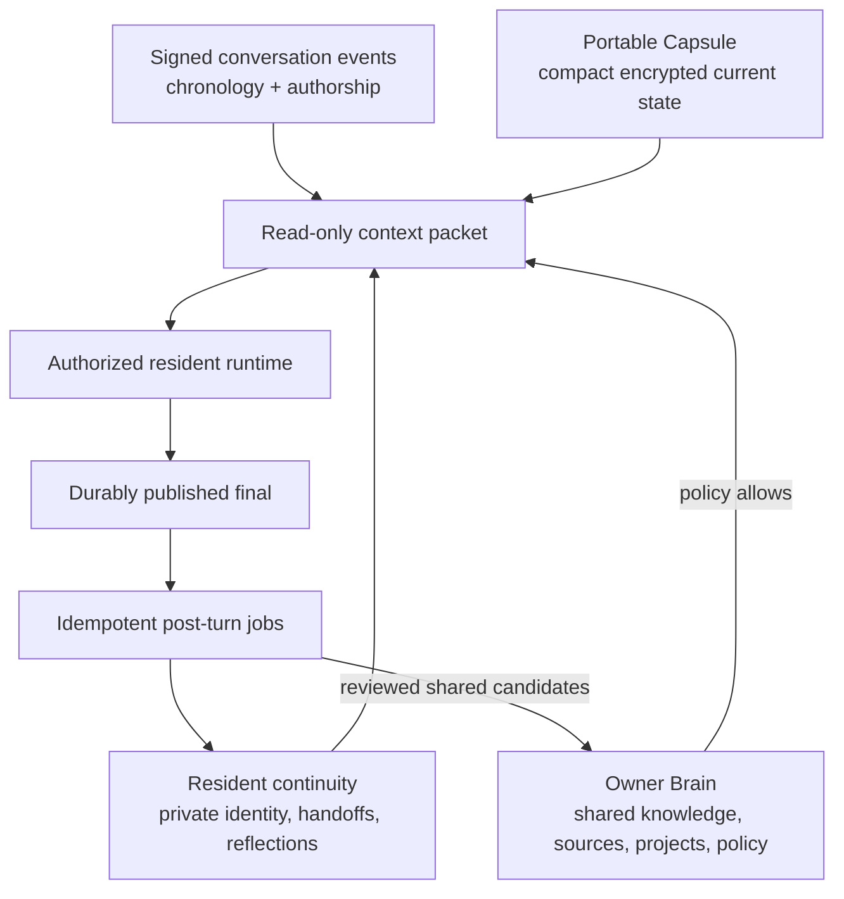

# Vision and Boundaries

## Product promise — Settled

Luca discovers compatible intelligence already present on a person’s machine, lets them choose what to bring in, and gives authorized residents grounded access to the relevant parts. The experience is local-first, legible, and useful even with zero imports.

This is the product-level successor to the prior Luca/Mnemos brain experience,
not a replacement for native Mnemos data, resident-private continuity, or the
existing Luca encrypted continuity kernel. Unified Brain unifies governed access
and presentation while those authorities remain separate.

## Four authorities — Proposed contract

- Conversation events are canonical history, not a memory database.
- Resident continuity is bound to owner + resident identity and is never an implicit shared pool.
- The Capsule is a portable projection, never the full archive.
- The Owner Brain is a governed source-backed knowledge layer, not a dump of all local files.

## Core rules — Settled

1. Discovery is read-only and local.
2. Import requires an affirmative source selection; refresh follows an explicit policy.
3. Every durable record keeps source lineage, scope, time, and transformation history.
4. Recall during a turn is an immutable authorized snapshot; it does not mutate memory, graph edges, or permissions.
5. Durable updates run after a final is accepted and are idempotent, inspectable, correctable, archivable, and forgettable.
6. Memory is reference data, never configuration or authority over tools, permissions, routing, budgets, or keys.
7. Conversation remains usable if every Unified Brain component is absent, locked, slow, corrupt, or disabled.

## Graph position — Proposed

Graphs are **derived knowledge projections**, not the source of authority.

| Projection | Purpose | First-use posture |
|---|---|---|
| Local full-text index | precise source retrieval | baseline |
| Semantic index | paraphrase and concept retrieval | optional, policy-bound |
| Temporal memory graph | evolving people, projects, decisions, relationships | later, provenance-first |
| Code graph | symbols, dependencies, calls, tests, ownership per repository | pilot adapter |
| Corpus graph | claims, entities, and communities in a selected stable corpus | later, opt-in |

No graph can erase source lineage, bypass access policy, or cause a durable write merely because an edge exists.

## Explicit non-goals for the first wave — Deferred

- importing every file on disk;
- automatic transcript indexing without selection;
- automatic cloud access or provider egress;
- global cross-resident private memory;
- background autonomous cognition as a messaging dependency;
- unproven multi-device concurrent authority;
- claiming native session restoration for runtimes that do not prove it.
- rebuilding the shipped Resident Notebook, Living Journal, native resident
  import, or Project to Room navigation.
