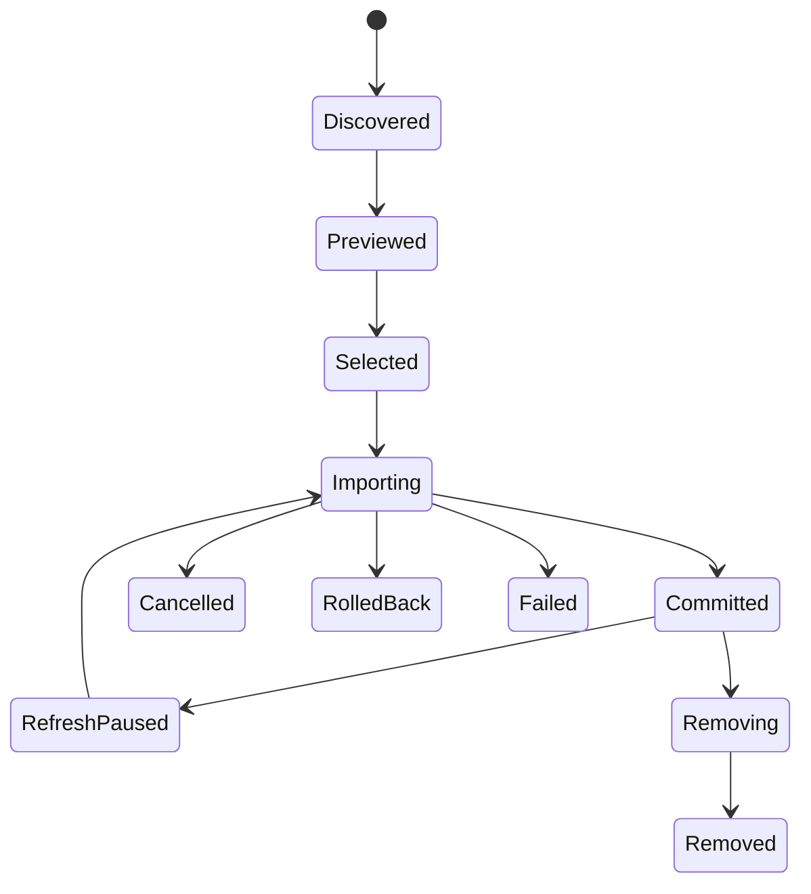

# Onboarding and Source Adapters

## Reopenable Brain Setup experience

This flow lives inside Brain Setup after Luca owner onboarding. It is optional,
works with zero imports, and can be reopened later. It does not replace native
resident setup or silently couple project creation, source import, room
assignment, and resident grants.

### Phase 1 — Discover

Luca runs a bounded local scan for supported, non-content metadata. It reports only what it can safely identify: product name, source class, approximate scope, availability, and whether explicit filesystem permission is needed.

### Phase 2 — Understand

Show a human inventory, not a technical scanner dump:

| Group | User sees | Examples |
|---|---|---|
| Agents and continuity | “We found agents you may want Luca to connect.” | Hermes, OpenClaw, Mnemos |
| Sessions | “We found prior work you may want to bring forward.” | Codex, Claude Code exports/histories |
| Active work | “We found projects you work in.” | local repositories, selected folders |
| Knowledge | “Choose notes or archives to include.” | exports, documents, chosen folders |
| Optional integrations | “Available when you use it.” | Tab Ledger |

### Phase 3 — Choose

Offer exactly three simple entry routes inside Brain Setup:

1. **Set up my agents** — select supported residents and preview current continuity.
2. **Bring in active work** — create or confirm a project, then separately
   select repositories, work folders, or relevant sessions as later adapters
   become available.
3. **Start empty** — no import, no penalty, rediscover later.

Advanced controls expose source-level selection, source permissions, refresh policy, and provider-egress choices. They are never a setup prerequisite.

### Phase 4 — Import and verify

Every selected source gets a preview, staged import status, post-import receipt, and a visible undo/remove route. “Imported” must never be shown before the job reaches committed state.

## Adapter lifecycle

## Priority adapters

The active V1.2 adapter is one explicitly selected Markdown/text file or folder.
The list below begins only after V1.2's installed source-and-grant gate passes.

| Order | Adapter | First scope | Do not do |
|---|---|---|---|
| 1 | discovery framework | synthetic fixtures only | read real content during scan |
| 2 | Mnemos | preview and migration mapping | silently merge stores or create split-brain writes |
| 3 | Hermes/OpenClaw status | reuse connected residents and existing continuity | rebuild native import or modify native credentials/config |
| 4 | Codex/Claude Code history | selected project/session import | claim complete native session reconstruction |
| 5 | repository metadata | selected project metadata + source records | recurse all user directories by default |
| 6 | code graph pilot | one selected repository, read-only query projection | modify assistant hooks or source repository files |
| 7 | Tab Ledger | optional detected installation | make it a required schema or dependency |

## Graph adapter requirements

A repository graph adapter may derive symbols, imports, calls, dependencies, tests, ownership hints, and architecture clusters. It must:

- remain bound to a repository source ID and revision;
- clearly label inferred edges and confidence;
- make raw source navigation available for every claim;
- rebuild on revision changes instead of silently mixing versions;
- be read-only toward repositories and external assistant configuration;
- participate in ordinary authorization before query results enter a context packet.
